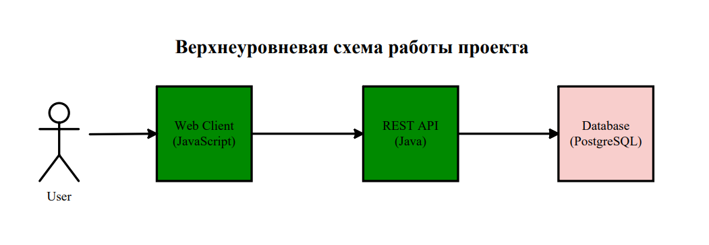

# Учёт участия студентов в олимпиадах и конкурсах

Проект посвящен учёту участия студентов в олимпиадах и конкурсах.

Цели и задачи проекта:

* Автоматизация учёта участий студентов в олимпиадах и конкурсах (разработка модульной системы ведения, просмотра,
  поиска
  и отчётности по участиям);
* Обеспечение актуальности и прозрачности данных (исключение дублей, блокировка редактирования по регламенту,
  отслеживание
  изменений).

## Структура проекта

Проект логически разделён на следующие модули:

* backend: код api-сервиса;
* db: данные для базы данных;
* frontend: код frontend-сервиса;
* test: тест-кейсы;
* design: макет в figma.

## Предварительно

Приложение работает по следующей верхнеуровневой схеме:



При создании проекта были сделаны следующие вещи:

* Разработана схема базы данных, описаны основные api методы, а также экранные формы;
* Разработан дизайн (макет) приложения;
* Написан api-сервис;
* Написан frontend-сервис;
* Протестированы оба сервиса.

## Запуск

Запустить приложение можно через docker-контейнер с помощью docker-compose файла или же собрать проект и запустить,
следуя инструкциям в папках backend и frontend.

Для запуска через docker вам, конечно, понадобится установленный на вашу машину docker. Запуск достаточно прост:

1) Копируем файл docker-compose.yaml себе на локальную машину.
2) Переходим в папку где он лежит и в консоли вводим команду:
   ```shell
   # Запускаем приложение через docker-compose;
   docker compose up;
   ```
3) Теперь приложение доступно на локальном хосте и порту 5173.
4) Для остановки приложения можно нажать Ctrl+C или же ввести команду:
   ```shell
   # Останавливаем приложение;
   docker compose down;
   ```

Если же вы хотите собрать полностью проект и запустить у себя, то процесс может выглядеть примерно так:

1) Убедитесь, что у вас установлены необходимые инструменты, вроде Apache Maven, Node.js, JDK. Также убедитесь, что
   порты 8080 и 5173 свободны (или те порты, что вы указали для запуска).
2) Следуйте инструкциям ниже, чтобы запустить backend:
   ```shell
   # Клонируем проект на локальную машину;
   git clone https://github.com/a-slelin/student-competitions.git;
   
   # Переходим в папку проекта;
   cd student-competitions;
   
   # Переходим в каталог api-сервиса;
   cd backend;
   
   # Собираем jar архив api-сервиса;
   mvn clean package;
   
   # Запускаем api-сервис;
   # Заметьте, что вам нужна указать параметры подключения к базе данных;
   # Также стоит сказать, что создание необходимых элементов в база данных;
   # вроде таблиц автоматически применится к базе данных, которую вы укажете;
   java -jar target/StudentCompetitionsApi.jar \
        --DB_HOST=<ваш хост для базы данных> \
        --DB_PORT=<ваш порт для базы данных> \
        --DB_NAME=<название вашей базы данных> \
        --DB_USERNAME=<пользователь в базе данных> \
        --DB_PASSWORD=<пароль для данного пользователя>;
   ```
3) Теперь api-сервис доступен на локальном хосте на порту 8080.
4) Запустим frontend:
   ```shell
   # Переходим в каталог frontend;
   cd ../frontend
   
   # Скачиваем необходимые библиотеки;
   npm install;
   
   # Запускаем frontend-сервис;
   npm run dev;
   ```
5) Теперь frontend-сервис доступен на локальном хосте на порту 5173.
6) Для остановки работы сервисов используйте Ctrl+C.

## Версии

* У проекта существует только одна версия - 1.0.0, которую можно также найти через соответствующий тег.

## Статус

* Проект был сдан 24 декабря 2025 года.

## Разработчики

* Ананов Михаил (**Dominus-Exitio**) - системный аналитик;
* Гаджигасанов Тимур (**Soulnier**) - тестировщик;
* Гонобоблев Иван (**Konsulot**) - frontend-разработчик;
* Соловьёв Евсей (**AdskiySotona666**) - дизайнер;
* Слелин Александр (**a-slelin**) - backend-разработчик.